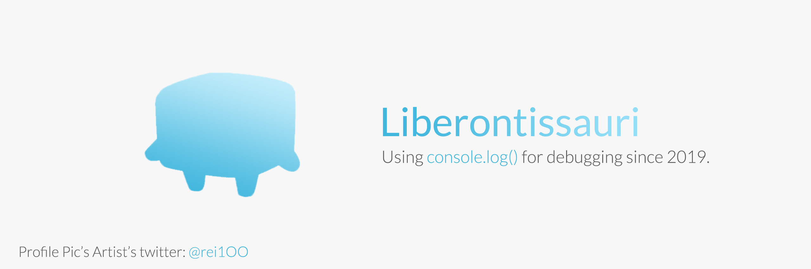

</img>
<h1 align="center">
HeyHey!
</h1>
  

Developing software since 2019, I've always loved to learn new technologies and solve problems! I also like to teach coding to other people, because I believe knowledge should be accessible to everyone 🙃

<a href="https://github.com/Liberontissauri">
Check My Website!
</a>

 

</img>

 

</img>

<h3 align="center">Techonlogies and Tools</h3>

</img>
</img>
</img>
</img> 
</img>
</img>
</img> 
</img>
</img>

